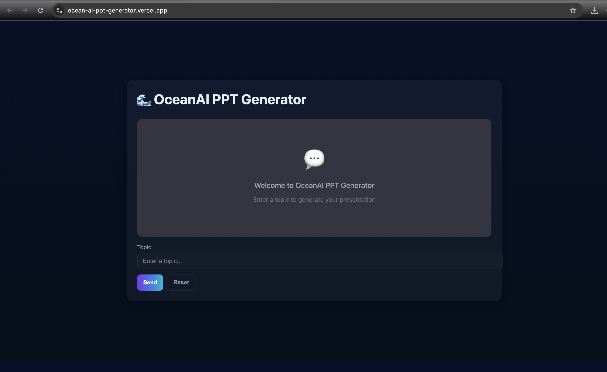

# OceanAI PPT Generator 🌊

OceanAI is an AI-powered web application that leverages Google's Gemini LLM to automatically generate professional PowerPoint presentations (.pptx) from simple topic descriptions. Built with Next.js and FastAPI, it provides an intelligent, conversational interface for creating structured business documents.

## 🚀 Live Demo

**The application is now live and deployed!**

🔗 **[https://ocean-ai-ppt-generator.vercel.app/](https://ocean-ai-ppt-generator.vercel.app/)**



## 👨‍💻 Author

**Name:** Sarvesh Nalawade  
**Reg. No.:** 22BCE1575  
**Email:** nalawadesarvesh98@gmail.com  
**GitHub:** [@Sarvesh-Nalawade](https://github.com/Sarvesh-Nalawade)  
**Repository:** [OceanAI_PPT_Generator](https://github.com/Sarvesh-Nalawade/OceanAI_PPT_Generator)

## ✨ Features

-   **Conversational AI:** Engage with the AI to refine presentation topics and requirements
-   **Automated Slide Generation:** Automatically generates Python code to create professional `.pptx` files
-   **Dynamic Content:** Generated presentations include titles, content, tables, and charts (bar, pie)
-   **Error Handling:** Integrated debugger automatically fixes errors in generated presentation code
-   **Interactive Web Interface:** Clean, responsive Next.js frontend for seamless user experience
-   **Session History:** Retrieve chat and generation history
-   **Export Capability:** Download ready-to-use PowerPoint presentations

## 🛠️ Tech Stack

| Component | Technology |
| :-------- | :--------- |
| **Frontend** | [Next.js](https://nextjs.org/), [React](https://react.dev/), [TypeScript](https://www.typescriptlang.org/) |
| **Backend** | [FastAPI](https://fastapi.tiangolo.com/), [Python](https://www.python.org/) |
| **AI/LLM** | [Google Gemini 2.5 Pro](https://deepmind.google/technologies/gemini/), [LangChain](https://www.langchain.com/) |
| **Document Generation** | [python-pptx](https://python-pptx.readthedocs.io/) |
| **Deployment** | [Vercel](https://vercel.com/) (Frontend), FastAPI Backend |

## 📁 Project Structure

```
OceanAI/
├── Backend/
│   ├── agents.py                 # Core LLM logic, code generation, and execution
│   ├── main.py                   # FastAPI application and API endpoints
│   ├── requirements.txt          # Python dependencies
│   ├── .env                      # Environment variables (API keys)
│   ├── pptx_docs/                # Reference docs for pptx code generation
│   ├── temp/                     # Temporary files (generated code, pptx)
│   └── generate.ipynb            # Jupyter notebook for experiments
│
└── frontend/
    ├── pages/
    │   ├── _app.tsx              # Next.js app configuration
    │   └── index.tsx             # Main application page
    ├── components/
    │   ├── ErrorDisplay.tsx      # Error handling component
    │   └── PDFviewer.tsx         # PDF viewer component
    ├── public/
    │   └── styles.css            # Global styles
    └── package.json              # Node.js dependencies
```

## 🚀 Getting Started

### Prerequisites

-   **Python 3.9+** (3.10 recommended)
-   **Node.js 18+** and npm/yarn/pnpm
-   **Google API key** with access to the Gemini API
-   **LangChain API key** (optional, for tracing)

### Backend Setup

1.  **Navigate to the backend directory:**
    ```bash
    cd Backend
    ```

2.  **Create a virtual environment:**
    ```bash
    # Using venv
    python -m venv venv
    source venv/bin/activate  # On Windows: venv\Scripts\activate
    
    # Or using conda
    conda create -n oceanai python=3.10
    conda activate oceanai
    ```

3.  **Install dependencies:**
    ```bash
    pip install -r requirements.txt
    ```

4.  **Configure environment variables:**
    
    Create a `.env` file in the `Backend` directory:
    ```env
    TEMP_DIR=./temp
    PPT_CODE_FILE=./temp/generated_ppt_code.py
    PPT_PPT_FILE=./temp/generated_presentation.pptx
    GOOGLE_API_KEY="your-google-api-key-here"
    LANGCHAIN_TRACING_V2=true
    LANGCHAIN_PROJECT=ocean_ai-ppt
    LANGCHAIN_API_KEY="your-langchain-api-key-here"
    ```

5.  **Run the backend server:**
    ```bash
    uvicorn main:app --reload
    ```
    
    The API will be available at `http://localhost:8000`

### Frontend Setup

1.  **Navigate to the frontend directory:**
    ```bash
    cd frontend
    ```

2.  **Install dependencies:**
    ```bash
    npm install
    # or
    yarn install
    # or
    pnpm install
    ```

3.  **Run the development server:**
    ```bash
    npm run dev
    # or
    yarn dev
    # or
    pnpm dev
    ```

4.  **Open your browser:**
    
    Navigate to [http://localhost:3000](http://localhost:3000)

## 📡 API Endpoints

### Backend API

| Method | Endpoint | Description |
| :----- | :------- | :---------- |
| `GET` | `/` | Health check |
| `POST` | `/generate` | Generate PowerPoint presentation (form field: `topic`) |
| `GET` | `/session_history?session_id=1` | Retrieve session history |

### Usage Example

**Generate a PPT via cURL:**
```bash
curl -X POST -F "topic=Market Analysis of EV Industry 2025" \
  http://localhost:8000/generate --output output.pptx
```

## 🏗️ Architecture

The application uses a modern, scalable architecture:

1. **Frontend (Next.js):** Provides an interactive UI for users to input topics and download generated presentations
2. **Backend (FastAPI):** Exposes REST API endpoints for presentation generation
3. **AI Agent (LangChain + Gemini):** Orchestrates the content generation, code creation, and debugging process
4. **Document Generator (python-pptx):** Creates professional PowerPoint files based on AI-generated Python code

## 🌟 How It Works

1. User submits a presentation topic through the web interface
2. FastAPI backend receives the request and forwards it to the AI agent
3. Gemini LLM generates Python code using the python-pptx library
4. Code is automatically executed to create the presentation
5. If errors occur, the debugger agent attempts to fix them
6. Final `.pptx` file is returned to the user for download

## 🤝 Contributing

Contributions, issues, and feature requests are welcome! Feel free to check the [issues page](https://github.com/Sarvesh-Nalawade/OceanAI_PPT_Generator/issues).

## 📄 License

This project is part of an academic assignment for AI-Assisted Document Authoring and Generation Platform.

## 🙏 Acknowledgments

- Google Gemini API for powerful LLM capabilities
- LangChain for agent orchestration framework
- python-pptx for PowerPoint generation
- Vercel for seamless deployment
