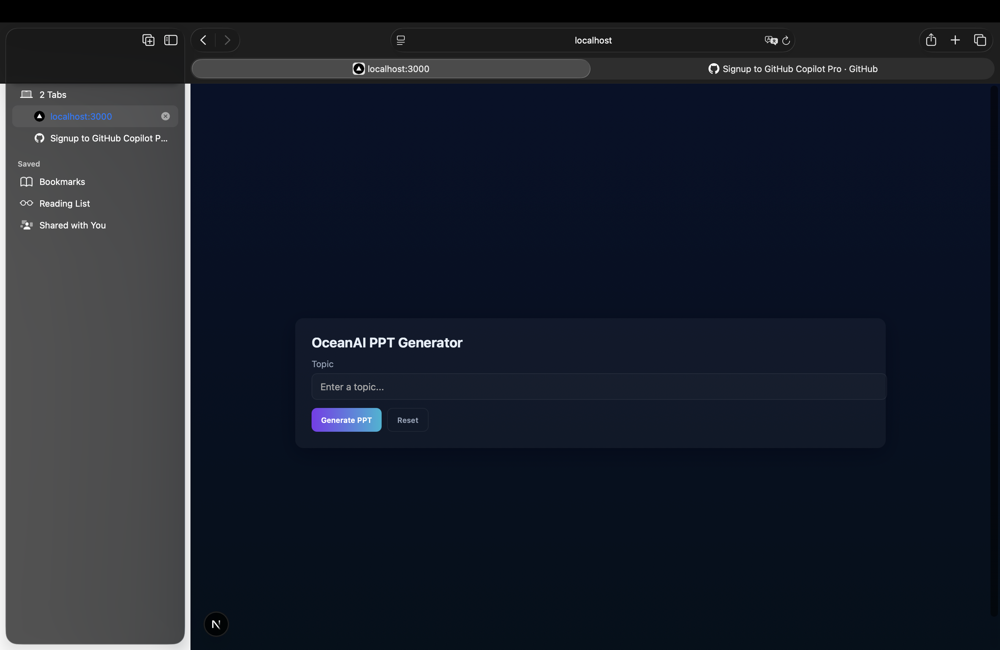

# OceanAI PPT Generator 🌊

OceanAI is a web application that leverages the generative power of Google's Gemini LLM to automatically create PowerPoint presentations (.pptx) from a simple topic description.

## Project Status

**On Hold:** This project is currently on pause due to exams.
**Expected Completion:** Development will resume and is scheduled to be completed by 11:00 PM on November 27, 2025.

## Live Demo

Once completed and deployed, the application will be accessible at:
**[https://ocean.svastiindustries.com](https://ocean.svastiindustries.com)**



## Features

-   **Conversational AI:** Engage in a conversation with the AI to refine the presentation topic and requirements.
-   **Automated Slide Generation:** Automatically generates Python code to create a `.pptx` file.
-   **Dynamic Content:** The generated presentations include titles, content, tables, and charts (bar, pie).
-   **Error Handling:** An integrated debugger attempts to automatically fix errors in the generated presentation code.
-   **Web Interface:** A simple, clean Next.js frontend to interact with the backend service.

## Tech Stack

| Area    | Technology                               |
| :------ | :--------------------------------------- |
| **Frontend** | [Next.js](https://nextjs.org/), [React](https://react.dev/), [TypeScript](https://www.typescriptlang.org/) |
| **Backend**  | [Python](https://www.python.org/), [LangChain](https://www.langchain.com/), [Gemini 2.5 Pro](https://deepmind.google/technologies/gemini/), [python-pptx](https://python-pptx.readthedocs.io/) |
| **Planned Backend** | [FastAPI](https://fastapi.tiangolo.com/) |

## Architecture

The current backend logic is implemented in a Jupyter Notebook (`Backend/generate.ipynb`). It uses the LangChain framework to create an agent powered by the Gemini 2.5 Pro model. This agent can generate, execute, and debug Python scripts that produce `.pptx` files.

The frontend is a Next.js application that will eventually communicate with a FastAPI backend that will wrap the core presentation generation logic.

## Getting Started

### Prerequisites

-   Python 3.9+
-   Node.js and npm (or yarn/pnpm/bun)
-   A Google API key with access to the Gemini API.

### Backend Setup

1.  **Navigate to the backend directory:**
    ```bash
    cd Backend
    ```

2.  **Create a virtual environment (recommended):**
    ```bash
    python -m venv venv
    source venv/bin/activate # On Windows use `venv\Scripts\activate`
    ```

3.  **Install dependencies:**
    ```bash
    pip install -r requirements.txt
    ```

4.  **Set up environment variables:**
    -   Create a `.env` file in the project root (`/Users/sarvesh/MyMacbook/Projects/OceanAI/.env`).
    -   Add your Google API key to the `.env` file:
        ```
        GOOGLE_API_KEY="YOUR_API_KEY_HERE"
        ```

### Frontend Setup

1.  **Navigate to the frontend directory:**
    ```bash
    cd frontend
    ```

2.  **Install dependencies:**
    ```bash
    npm install
    ```

3.  **Run the development server:**
    ```bash
    npm run dev
    ```

4.  Open [http://localhost:3000](http://localhost:3000) with your browser to see the frontend.

## Future Plans

-   **Backend Migration:** The core logic currently in `Backend/generate.ipynb` will be migrated to a robust FastAPI application. This will expose a proper API for the frontend to consume.
-   **Full Integration:** Connect the Next.js frontend to the FastAPI backend to create a seamless user experience.
-   **Deployment:** Host the complete application at the specified domain.
